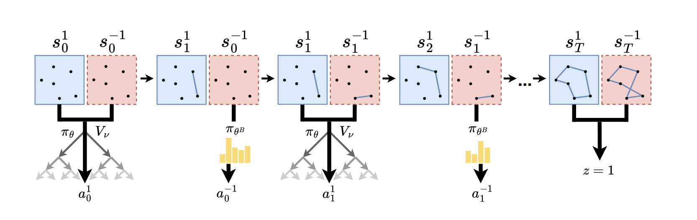

# Gumbel AlphaZero 'Play-to-Plan'



Official implementation in PyTorch of the algorithms discussed in the paper ["Policy-Based Self-Competition for Planning Problems"](https://openreview.net/forum?id=SmufNDN90G), accepted to ICLR 2023. Hyperparameters and model structures are explained in detail in the Appendix.

The file structure is loosely based on the great MuZero-repository [https://github.com/werner-duvaud/muzero-general/](https://github.com/werner-duvaud/muzero-general/).

Within the code, we use the terms 'newcomer' and 'best' for 'greedy actor' and 'learning actor', because in ray.io the term *actor* has a different meaning. 

Config files can be found for all methods and problem classes in the folders `gaz_ptp/config/*.py`, `gaz_singleplayer/config_*/*.py`. Documentation for the parameters are given as comments in the file `base_config.py`.

We use ray.io for parallel training and game generation. In particular, make sure to put in suitable values in the config files for the following parameters:

- `num_experience_workers` (int): Number of actors (processes) which generate games.
- `num_inference_workers` (int): Number of actors which perform network inferences, by collecting states, batching them and evaluating them on the GPU(s).
- `inference_on_experience_workers` (bool): If True, states are not sent to the inference actors but evaluated directly on the experience worker.
- `pin_workers_to_core` (bool): Linux only. If True, workers are pinned to specific CPU cores, starting to count from 0. This is to prevent congestion when different PyTorch-instances fight for resources.
- `CUDA_VISIBLE_DEVICES` (str): Environment variable for visible cuda devices must be set manually, as ray can have problems detecting multiple GPUs. Set to e.g. "0,1,2,3" for 4 GPUs.
- `cuda_device` (str): Device id on which the networks are trained (e.g. "cuda:0"). If no GPUs are available, this setting is ignored.
- `cuda_devices_for_inference_workers` (List[str]): The i-th entry in this list indicates on which device the i-th inference worker should perform network evaluations. E.g., for 4 workers on a machine with 2 GPUs this can be set to `["cuda:0", "cuda:0", "cuda:1", "cuda:1"]`.

## Algorithm types

- For GAZ PTP, set the config parameter `gumbel_is_gt` to `True` if you want to train with the variant PTP GT ('Greedy Tree', i.e., the learning actor imagines the greedy actor as acting greedily also in the tree). Note that the implementation of ST and GT are structurally the same for convenience; see the paper how the implementation for GT can be sped up significantly. If training with GAZ PTP, set `self.singleplayer_options` to `None` in the config files.
- For singleplayer variants, the attribute `self.singleplayer_options` must be set to a dictionary specifying which variant is used. These are: Single Vanilla ("single_vanilla"), Single Timestep ("single_timestep"), Single N-Step ("single"), Greedy Scalar ("greedy_scalar"). Check the config files for TSP 20 in the respective folders to see how this works for each variant.

## Running an experiment

Change the parameters in the config file which should be run, and start an experiment via 

```
$ python main.py --problem-type="<problem>" --size="<problem size>" --method="<algorithm>"
```

Possible options are:

- **\<problem>**: "jssp" for Job Shop Scheduling or "tsp" for Traveling Salesman Problem
- **\<problem size>**: "15\_15", "20\_20" or "30\_20" for JSSP (num jobs x num machines) or "20", "50" or "100" for TSP (num cities)
- **\<method>**: "ptp" for GAZ PTP, "greedy\_scalar" for GAZ Greedy Scalar, "single\_vanilla" for GAZ Single Vanilla, "single\_nstep" for GAZ Single N-Step, and "single_timestep" for GAZ Single Timestep.

For example, to run TSP with 20 cities with GAZ PTP:

```
$ python main.py --problem-type="tsp" --size="20" --method="ptp"
```


## Citations

```
@inproceedings{pirnaypolicy,
  title={Policy-Based Self-Competition for Planning Problems},
  author={Pirnay, Jonathan and G{\"o}ttl, Quirin and Burger, Jakob and Grimm, Dominik Gerhard},
  booktitle={International Conference on Learning Representations (ICLR)},
  year={2023}
}
```

## Acknowledgments

Thanks to:

- [muzero-general](https://github.com/werner-duvaud/muzero-general/)
- [mctx](https://github.com/deepmind/mctx)
- [former](https://github.com/pbloem/former)
- [attention-learn-to-route](https://github.com/wouterkool/attention-learn-to-route)